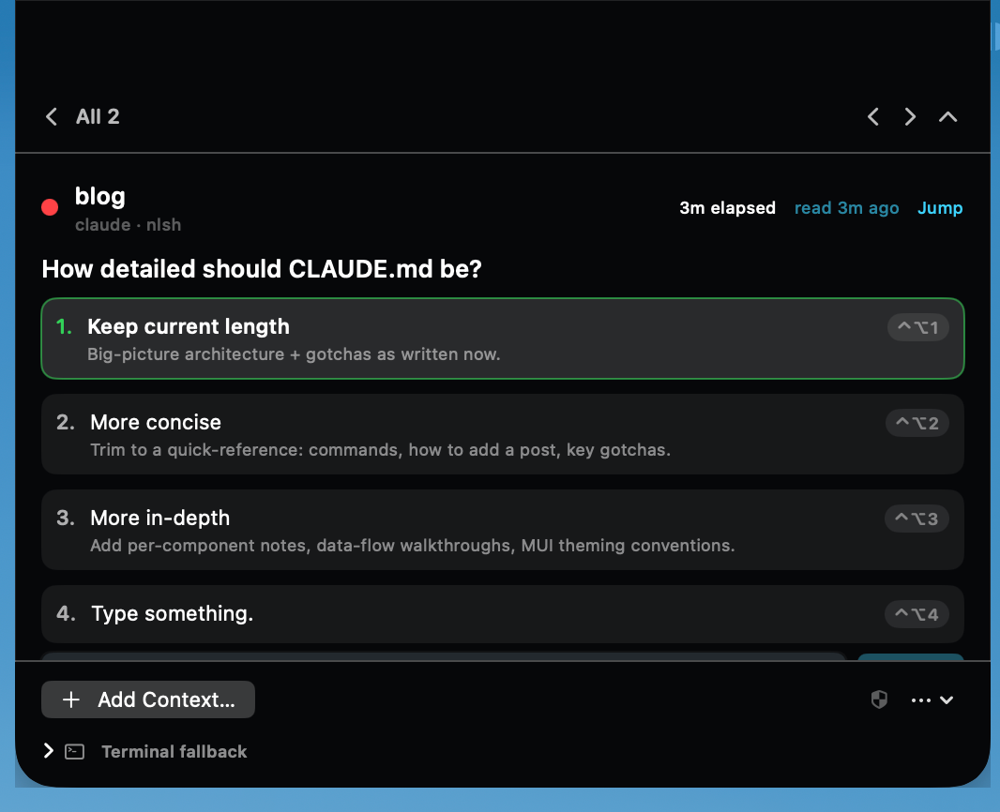
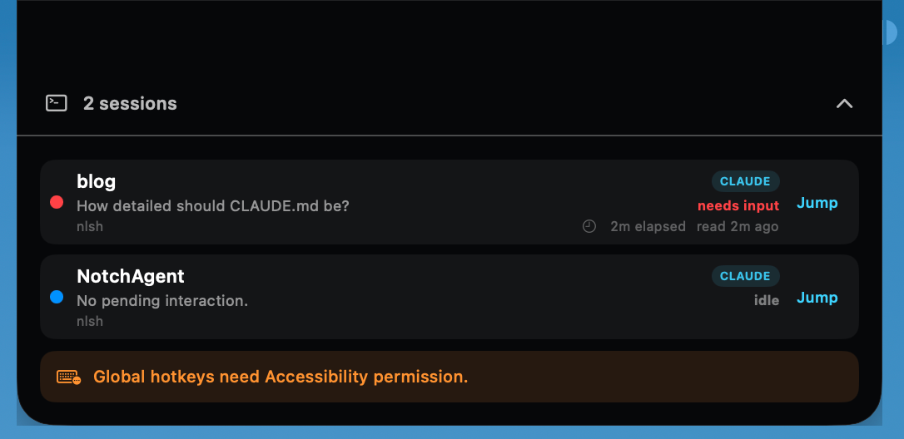
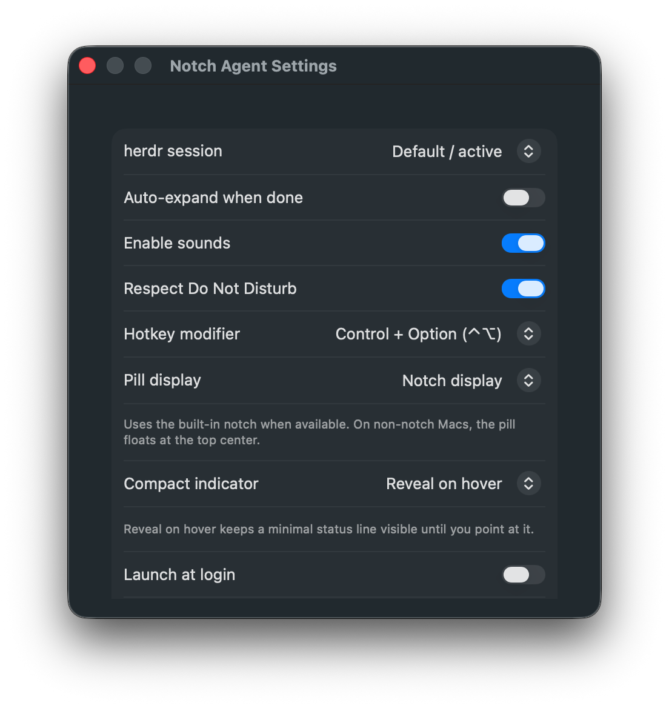

# NotchAgent

A native macOS notch control surface for AI coding agents running under
[herdr](https://herdr.dev) in Ghostty. **Monitor, approve or deny, answer, and
jump to** your agents from the MacBook notch — without hunting through terminal
panes for the one that needs you.

herdr is the state authority (it normalizes 15+ agents into one status model and
a JSON socket API); this app is a **socket client + notch `NSPanel` UI**. The core
hydrates from snapshots, reconciles agent state continuously, and treats events as
an accelerator. The UI stays thin and every response remains explicitly user-driven.

<p align="center">
  
</p>

## What it does

- Shows a minimal color-coded status line below the notch, revealing the agent
  count on hover or keeping it visible if you prefer.
- Opens the relevant interaction when an agent becomes blocked and needs input.
- Collects every herdr session in one overview with status, prompt, elapsed time,
  and a direct jump back to its Ghostty pane.
- Turns supported approvals and questions into explicit, clickable actions while
  preserving a terminal fallback for anything uncertain.
- Supports display placement, global hotkeys, sounds, Do Not Disturb, and launch
  at login without adding a Dock icon.

## Screenshots

| Minimal blocked indicator | Agent count on hover |
| --- | --- |
|  |  |

### See every agent at a glance



### Configure the experience

<p align="center">
  
</p>

## Requirements

- macOS 14+ on Apple Silicon, Swift 6.2 toolchain (Xcode 16+).
- **[herdr](https://herdr.dev) must be installed and running**, with Ghostty
  attached to it, before NotchAgent can discover or control agents.
- No third-party dependencies (Foundation/AppKit/SwiftUI + POSIX sockets).

## Install

With Homebrew:

```bash
brew install --cask ykushch/tap/notchagent
```

Alternatively, download `NotchApp-<version>.zip` from GitHub Releases, extract
it, and move `NotchApp.app` to `/Applications`.

Release bundles are ad-hoc signed rather than notarized, so macOS may block the
first launch. Right-click the app and choose **Open**, or remove quarantine:

```bash
xattr -dr com.apple.quarantine /Applications/NotchApp.app
```

To build an app bundle from source:

```bash
./bundle.sh && open build/NotchApp.app
```

On first launch, grant **Notch Agent** access in **System Settings → Privacy &
Security → Accessibility**. This permission is required for global shortcuts and
agent actions; if a stale denied entry exists, remove it with the − button first.

## Build

```bash
swift build            # all targets
swift test             # full test suite (swift-testing)
```

## Releasing

GitHub Actions builds and tests every push and pull request to `main` on the
`macos-15` runner with Xcode 16.4. A pushed version tag runs the same tests,
builds `NotchApp-<version>.zip`, verifies the app and archive signatures,
publishes a GitHub Release with generated notes, and updates the Homebrew cask.

The release workflow needs one repository secret named `HOMEBREW_TAP_TOKEN`.
Create a fine-grained personal access token restricted to the
`ykushch/homebrew-tap` repository with **Contents: Read and write**, then add it
under **Settings → Secrets and variables → Actions** in this repository. The
built-in `GITHUB_TOKEN` publishes the release itself and does not need another
secret.

Once that secret is configured, releasing is just:

```bash
git tag -a v1.2.3 -m "NotchAgent 1.2.3"
git push origin v1.2.3
```

Tags must contain numeric dot-separated versions (`v1.2.3`); the workflow passes
the version to `bundle.sh` and writes the resulting archive SHA-256 into the tap.

## `notchctl` — headless CLI harness

Dogfoods the whole core (client + store + classifier + actions) before/without
the UI. Thin wrapper: all logic lives in the `HerdrClient` library.

```bash
swift run notchctl list                      # list all agents + rollup status (F1)
swift run notchctl watch                     # stream status changes; classify blocks (F1/F2/F4)
swift run notchctl read  <pane>              # show the classified prompt for a pane (F4)
swift run notchctl --json read <pane>         # normalized evidence + proposed response plans
swift run notchctl --json inspect <fixture>   # verify and inspect an offline .fixture directory
swift run notchctl --json dry-run <pane> option 2 # re-read + plan; never send input
swift run notchctl resolve <pane> <choice>   # choice = approve | deny | <option number> (F3/F4)
swift run notchctl reply <pane> <text...>    # free-text reply, submits with enter (F4/F9)
swift run notchctl jump  <pane>              # focus the pane + raise Ghostty (F5)
```

Global flags: `--json` (machine-readable output), `--sock <path>` (explicit
socket path; otherwise resolved from `HERDR_SOCKET_PATH` → `HERDR_SESSION` →
`~/.config/herdr/herdr.sock`).

Example:

```bash
$ swift run notchctl list
● w3:p1           working  claude   /Users/you/project *
○ w1:p1           idle     claude   /Users/you/other
```

`resolve`/`reply` read the pane's current prompt via `pane.read --source detection`,
classify it, and send **raw keys only** (herdr rejects `prefix+` chords). Unknown
prompt shapes fall back to a raw view — the tool never fabricates a keystroke.

### Interaction diagnostics

`read --json` reports the normalized provider and screen adapter, stable
fingerprint, interaction kind/content, choices/steps, presentation state,
capabilities, confidence, pane revision, and every proposed response plan or
explicit refusal. Output keys are sorted so identical evidence produces
byte-identical JSON. Raw terminal bytes are deliberately excluded; use
`capture` for raw evidence and `inspect` for normalized diagnostics.

`inspect <path>` verifies and parses a content-addressed `.fixture` directory
without connecting to herdr. A standalone detection file is also supported with
`--agent ID` and optional `--visible FILE`, `--pane ID`, and `--revision N`.

`dry-run <pane> <intent>` reads the interaction once, immediately re-reads it,
compares stable fingerprints, and plans from the fresh presentation. Its core
boundary has no action/transport sender and cannot write input. Supported intents
are `option N`, `check N`, `uncheck N`, `type TEXT`, `text TEXT`,
`option-text N TEXT`, `add-notes`, `clear-notes`, `previous`, `next`, `step N`,
`submit`, `approve`, `deny`, and `cancel`. Pass
`--expected-fingerprint HEX` to audit a previously observed identity.

## `NotchApp` — the notch UI

```bash
swift run NotchApp
```

Runs as an **accessory app** (no Dock icon, never steals focus). A non-activating
always-on-top `NSPanel` sits around the notch: a minimal status line reveals the
agent count on hover (or stays visible by preference), and a blocked agent opens
directly into its actionable interaction.
See [`Sources/NotchApp/README.md`](Sources/NotchApp/README.md) for the manual
test checklist.

## Layout

- `Sources/HerdrClient/` — the M1 core (socket client, models, state store, prompt
  classifier, action layer). See [`CLAUDE.md`](CLAUDE.md) for architecture + the
  protocol facts that shaped it.
- `Sources/notchctl/` — the CLI harness.
- `Sources/NotchApp/` — the notch UI (M2).
- `Tests/HerdrClientTests/` — swift-testing suite over recorded fixtures.
